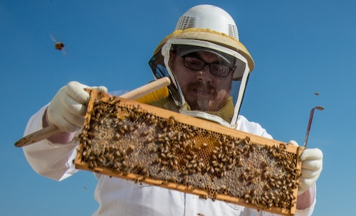

# Φ Pheye - a family of efficient small vision-language models

- These models train a fraction of the number of parameters other models of similar sizes train
- Are more efficient in how they incorporate vision into language tasks (dense cross-attention > LLaVA style architecture)
- Are more efficient in how the process high resolution input images
- Use less data to train yet achieve competitive results (if you want to redo this recipe using more data results will be even better)

## Benchmarks

| Model                                                         | Resolution | Trainable Params | Data | VQAv2 | Nocaps | TextVQA | TextCaps |
| ------------------------------------------------------------- | ---------- | ---------------- | ---- | ----- | ------ | ------- | -------- |
| MoE-LLaVA-1.6B×4                                              | 336        | 2.9B             | 5.9M | 76.0  | -      | 47.8    | -        |
| MoE-LLaVA-2.7B×4                                              | 336        | 5.3B             | 5.9M | 77.1  | -      | 50.2    | -        |
| moondream1                                                    | 384        | 1.86B            | 3.9M | 74.7  | -      | 35.6    |
| moondream2                                                    | 384        | 1.86B            | -    | 77.7  | 92.5   | 49.7    | 120.2    |
| [Pheye-x4 🤗](https://huggingface.co/miguelcarv/Pheye-x4-448) | 448        | 295M             | 2.9M | 75.2  | 110.1  | 45.9    | 106.4    |
| [Pheye-x4 🤗](https://huggingface.co/miguelcarv/Pheye-x4-672) | 672        | 295M             | 2.9M | 75.5  | 110.8  | 49.2    | 111.9    |
| [Pheye-x2 🤗](https://huggingface.co/miguelcarv/Pheye-x2-448) | 448        | 578M             | 2.9M | 76.0  | 111.8  | 47.3    | 108.9    |
| [Pheye-x2 🤗](https://huggingface.co/miguelcarv/Pheye-x2-672) | 672        | 578M             | 2.9M | 76.4  | 110.5  | 50.5    | 115.9    |

## Examples\*

| Image                                                                                     | Example                                                                                                                                                                                                                                                                                                                                                                                                                                                                                 |
| ----------------------------------------------------------------------------------------- | --------------------------------------------------------------------------------------------------------------------------------------------------------------------------------------------------------------------------------------------------------------------------------------------------------------------------------------------------------------------------------------------------------------------------------------------------------------------------------------- |
|  | **How much do these popcorn packets weigh?**<br>These popcorn packets weigh 90g each.<br><br>**What brand are these popcorn packets?**<br>These popcorn packets are from the brand "Magic Pop".                                                                                                                                                                                                                                                                                         |
|  | **Can I pet that dog?**<br>No, you cannot pet the dog in the image. It is a black bear, not a dog.                                                                                                                                                                                                                                                                                                                                                                                      |
|                                            | **Why is the person wearing protective gear?**<br>The person in the image is wearing protective gear, such as a beekeeper's suit and a helmet, to ensure their safety while working with bees. Beekeeping involves handling bees and their hives, which can be potentially dangerous due to the risk of bee stings. The protective gear helps to minimize the risk of bee stings and other bee-related injuries, allowing the beekeeper to carry out their work safely and effectively. |
|                                                                                           |

\* Generated by Pheye-x2-672

## Usage

To generate a sample response from a prompt use `generate.py`.
Use a Python version >= 3.11. Start by cloning the repo and create a virtual environment with the necessary packages:

```bash
git clone https://github.com/miguelscarv/pheye.git
cd pheye
python3 -m venv venv
source venv/bin/activate
pip3 install -r requirements.txt
```

Then run `generate.py`:

```bash
python3 generate.py --image_path images/dog_flower.jpg --prompt "What is the dog holding in it's mouth?" --device cuda
```

## Acknowledgments

This implementation was inspired by [OpenFlamingo](https://github.com/mlfoundations/open_flamingo)'s repository.
